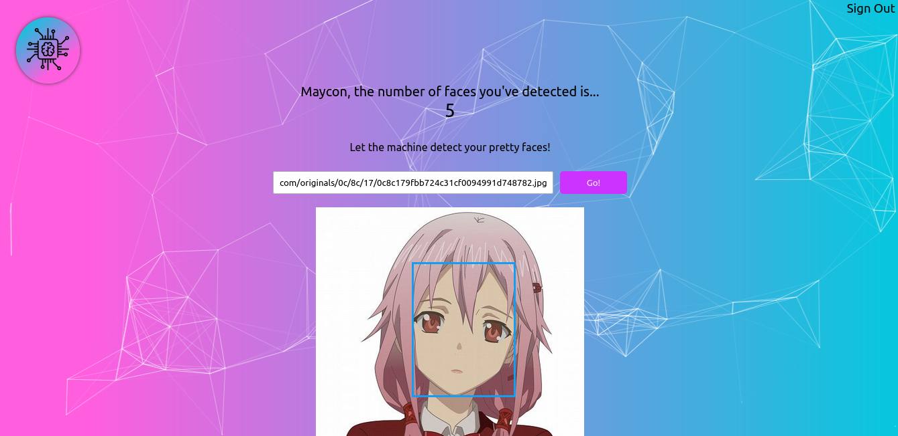

# Facecognition

This application was made with React.js and was intended to put these things into practice.
It lets you register, sign-in and send an image through an artificial intelligence API which tries to detect human faces.

Well, It also shows the number of submissions you've made, so, do your best! :)

